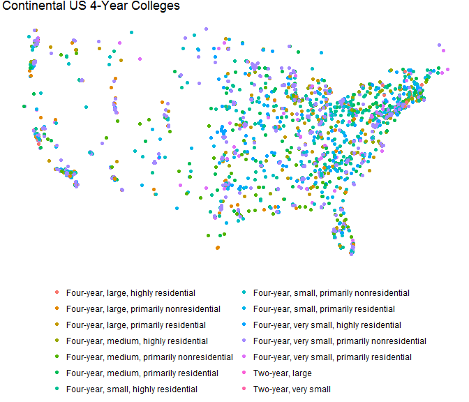

<!-- README.md is generated from README.Rmd. Please edit that file -->
uscolleges
==========

The uscolleges package provides a tidy version of the most recent College Scorecards from the US Department of Education.

Installation
------------

You can install the development version from [GitHub](https://github.com/) with:

``` r
# install.packages("devtools")
devtools::install_github("jonthegeek/uscolleges")
```

Example
-------

``` r
library(dplyr)
library(ggplot2)
uscolleges::uscolleges %>% 
  filter(location.lon > -130, location.lon < 0, location.lat > 20) %>% 
  filter(degrees_awarded.highest %in% c("Bachelor's degree", "Graduate degree")) %>% 
  filter(degrees_awarded.predominant != "Entirely graduate-degree granting") %>% 
  filter(!(carnegie_size_setting %in% c("Exclusively graduate/professional", "Not applicable"))) %>% 
  ggplot() + 
  aes(x = location.lon, y = location.lat) + 
  aes(color = carnegie_size_setting) + 
  geom_point() + 
  theme_void() + 
  theme(
    legend.position = "bottom", 
    legend.title = element_blank()
  ) +
  guides(color = guide_legend(nrow = 7)) +
  ggtitle("Continental US 4-Year Colleges")
```


